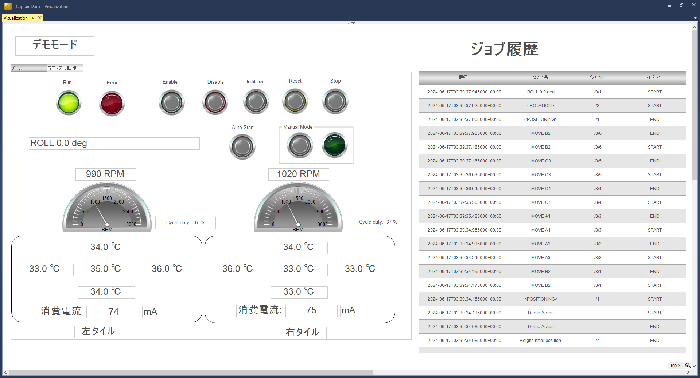

# XPlanar ちゃぶ台仕様 参考プログラム

XPlanarの2枚タイルと、ウルトラコンパクトIPCを用いた小さな磁気浮遊式搬送システムのTwinCATプロジェクトです。

## 特徴

* [ジョブ実行フレームワーク](https://github.com/Beckhoff-JP/PLC_JobManagementFramework)を用いる事で、動作ロジックと、それを使った動作パターンを切り離して実装できます。

    同じパターンの動作をファンクションブロック化し、これらを自由に組み合わせて動作シーケンスを構築できます。従来のようにプログラムコードで縛るのではなく、データで動作パターンを定義することができます。プログラム実装イメージは下記の通りです。

    

    このように、ジョブをフレームワーク上で実行することで柔軟に動作パターンを組めます。本デモプロジェクトでは、XPlanarの固定的な動作パターンを繰り返し実行するだけではなく、ボタン操作で動作パターンを定義し実行するマニュアルモードを搭載しています。
    
    また、フレームワーク化することでその実行結果のイベントを画一的に処理することができます。本デモでは、トレーサビリティ機能を搭載し、ジョブの実行開始、終了時刻を表形式で一覧するHMIを提供しています。
    
* [XPlanarタイルのEtherCATのCoEのSDOによる診断情報を読み取るライブラリ](https://github.com/Beckhoff-JP/TwinCATDiagnosisTools)による診断データの取得

    XPlanarタイルのSDOには診断データとしてタイル温度や冷却ファンの速度などが取得できます。EtherCATのCoE通信により診断情報を収集してHMI画面へ表示します。

## 必要ライブラリ

`bundle`フォルダに同梱している次の[ライブラリをインストール](https://beckhoff-jp.github.io/TwinCATHowTo/library/use_library.html#install-library)してください。

* JobManagement.library
* DiagnosisTools.library

## XPlanarの準備

ちゃぶ台のIPCと接続したTwinCAT XAE上にて本プロジェクトを開き、次のURL以後の手順にて、Configuratorによりbmlファイルを作成してください。作成したbmlを、マニュアルに示されている通りIPCの規定のフォルダへ配置してください。

https://beckhoff-jp.github.io/TwinCATHowTo/xplanar/configurator/index.html#id1

## 動作説明

IPCをRUNモードにし、ログイン後、PLCプロジェクトの`VISUs`フォルダ以下の`Visualization`を開きます。次の画面が現れます。下記の通りの画面構成となっています。

|画面構成|説明|
|---|---|
|メインタブ|メイン操作画面、および、診断情報が表示されます。デモモードのスタート、および、マニュアルモードへの移行はこの画面から行います。|
|マニュアル動作タブ|マニュアルモードにおける操作を行う画面です。XPlanarの任意の実行手順をジョブとして登録し、スタートボタンでジョブ実行できます。|
|ジョブ実行履歴|現在時刻、タスク名称、ジョブID、開始・終了イベントの履歴が一覧されます|

メイン画面の操作方法を次に示します。

|名称|説明|
|---|---|
|運転中|制御状態を示します。電源OFF, 原点復帰中, 運転中, サーボOFF中と表示されます。|
|Run|稼働中ランプです。点滅中にEnableボタンを押すことができます。次にDisableボタンを押すまでこのランプが点灯します。|
|Error|XPlanarのコントローラに何等かのエラーが発生した際の点灯します。解除可能な場合は、Resetボタンにて解除できます。|
|Enable|Xplanarへ電源が供給され、原点復帰に続いてデモ動作が開始されます。|
|Disable|Xplanarの電源をOFFします。|
|Initialize|原点復帰を実行します。|
|Reset|エラーの解除、または、Stopにより一時停止した際の動作再開時にこのボタンを押してください。|
|Stop|現在の動作を一時停止します。|
|Roll 0.0 deg|タスク名（現在実行中の処理内容）を表示します。|
|Auto start|デモモードを実行開始します。Initializeにより原点復帰完了後に実行可能となります。|
|Manual start|マニュアルモードに入ります。Initializeにより原点復帰完了後にモード移行可能となります。|

### デモモード

メイン画面において 次の操作でデモ動作が開始します。

1. Enableボタンを押してXPlanarの可動子のサーボをONする。
2. 原点復帰動作を開始。A、B軸とも水平、Z軸は初期の浮遊位置となり、最後にC軸回転動作を行います。終了したら「原点復帰完了」とステータス表示する。
3. Auto startボタンを押します。次のシーケンス動作を開始します。
    1. 直線動作4方向
    2. C軸（回転）動作
    3. Z軸（上下）動作
    4. A軸（前後傾き）動作
    5. B軸（左右傾き）動作
    6. A/B軸順次動作（前後左右）動作

### マニュアルモード

メイン画面において 次の操作でデモ動作が開始します。

1. Enableボタンを押してXPlanarの可動子のサーボをONする。
2. 原点復帰動作を開始。A、B軸とも水平、Z軸は初期の浮遊位置となり、最後にC軸回転動作を行います。終了したら「原点復帰完了」とステータス表示する。
3. Manual mode枠内のボタンを押す。ランプが点灯したらマニュアルモードへ移行完了です。
4. 画面のタブを「マニュアル動作」タブへ切り替えます。

|名称|説明|
|---|---|
|A1～C3|タイル上の位置までMoveToPositionで移動します|
|左傾|Z位置を6mmまで上昇した上で左側へ5°傾きます|
|右傾|Z位置を6mmまで上昇した上で右側へ5°傾きます|
|前傾|Z位置を6mmまで上昇した上で前側へ5°傾きます|
|後傾|Z位置を6mmまで上昇した上で後側へ5°傾きます|
|0°|C軸（回転軸）を原点位置に戻します。|
|90°|C軸（回転軸）を90°位置に回転します。|
|180°|C軸（回転軸）を180°位置に回転します。|
|270°|C軸（回転軸）を270°位置に回転します。|
|登録処理内容|ボタンを押した順序で処理内容が一覧されます|
|スタート|登録処理内容を順次実行します|

### 中断と再開

* Stopボタンを押すと、現在実行中のタスクを一時停止します。Resetボタンで再開します。
* Auto start, Manual modeを完全に終了させたい場合は、Initializeを行ってください。どの時点からもその場で原点復帰を行います。

### 注意事項

C回転動作は、タイルの端では実行できません。Manual modeや原点復帰動作では、特に制限をかけていませんので、万一タイルの端で回転動作を行った場合は、動作途中でハードウェアエラーが発生してサーボOFFする可能性があります。

このケースに至った場合は、再度Active configurationを行ってから最初からやりなおしてください。

### 診断機能

左右のタイルそれぞれで次の値を表示します。

1. 冷却ファン回転数（RPM）を数値と180°メータで表示します。
2. 指令回転数（デューティ比のパーセンテージ）
3. 中央、東西南北の温度計の値
4. 消費電流

## プログラミング

次の手順で、ジョブ実行フレームワークを用いた機能拡張が可能です。実装方法はこちらをご覧ください。

[https://beckhoff-jp.github.io/TwinCATHowTo/plc_object_oriented_programming/sample_universal_activity.html#id5](https://beckhoff-jp.github.io/TwinCATHowTo/plc_object_oriented_programming/sample_universal_activity.html#id5)